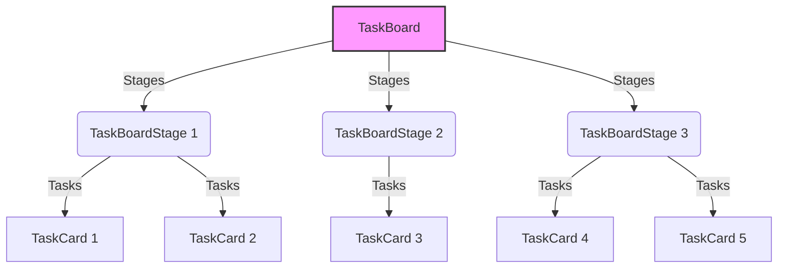

# Simple Task Manager

This assessment requires the development of a real-time task manager, featuring a Kanban board interface. Data synchronization will be achieved through a WebSocket service.

> [!NOTE]
>
> -   ❤️ Feel free to add any improvements or suggestions you consider.

1. [Goals](#001)
2. [Tech Stack](#002)
3. [Installation and running the project](#003)
4. [Samples](#004)
5. [Dev notes](#005)

<a name="001"></a>

### 🎯 Goals

###### More details in CHALLENGE.md file

-   Enable real-time synchronization of tasks using a provided mock WebSocket server.
-   Create a task board with three columns: To Do, In Progress, and Done.
-   Implement drag-and-drop functionality to reorder tasks or move them between columns.
-   Load a pre-populated list of 50-100 tasks from a mock API

<a name="002"></a>

### Tech Stack

This conceptual test has been developed using the following technologies:

-   **Front-end**
    -   [React](https://react.dev/)
    -   [TypeScript](https://www.typescriptlang.org/)
    -   [Ant Design](https://ant.design/)

<a name="003"></a>

### Installation and running the project

The project requires:

-   [NodeJS](https://nodejs.org/)

**Clone the repository:**

```shell
git clone https://github.com/christianjtr/simple-task-manager.git
```

**Scripts:**

Before executing these scripts, you must run **npm install** in the directory you just downloaded/cloned the codebase. _Other scripts are in package.json file. Also, you may consult the CHALLENGE.md file_.

```shell
# Start the development environment
> npm run dev

# Run unit tests
> npm run test

```

<a name="004"></a>

### Samples

1. Basic kanban board

<p align="center">
  
</p>

<a name="005"></a>

### Dev notes

###### Strategy followed

1. Basic implementation of Kanban Board UI (Component Composition)
2. Integrate WebSocket Data Synchronization (Custom Hook)
3. Redux integration (WebSocket/MockAPI orchestration)
4. Implement task management features
5. Ensure some real-time updates

###### Component composition


